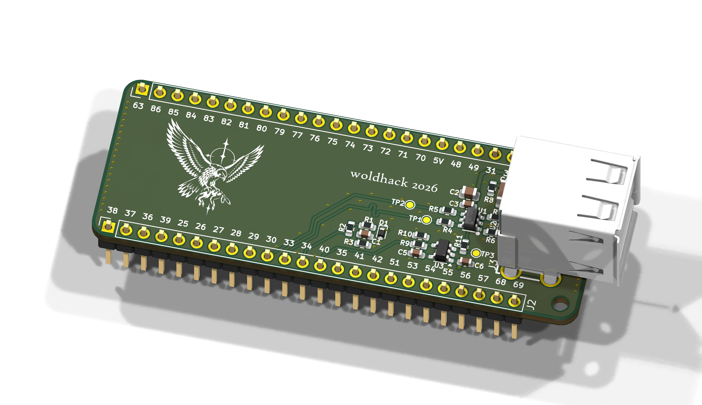
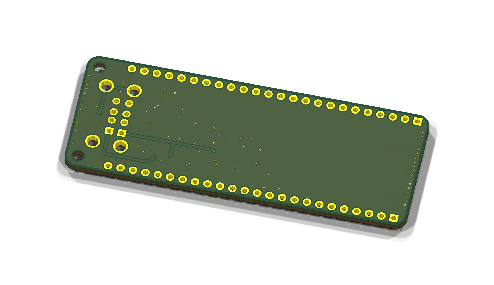

# Tang Nano 9K USB Low-Speed Sniffer HAT

A KiCad USB sniffer HAT for the **Tang Nano 9K**, designed to decode characters from compatible **1.5 Mb/s low-speed USB keyboards** on the FPGA and send them over UART. The USB data lines pass directly between host and device; buffered copies go to the FPGA. An FPGA-controlled power switch delays device power until reception is ready.

| Top — USB connector side | Bottom — through-hole models hidden |
| :---: | :---: |
|  |  |

> [!IMPORTANT]
> This repository currently contains the hardware design, enclosure, and design plan. `hdl/` is a placeholder: the FPGA receiver, USB/HID decoder, and character output are not implemented. There is no working sniffer bitstream or configured HDL build yet.

[Design plan](docs/plan.md) · [KiCad project](hardware/board/tang_nano_hat.kicad_pro) · [Case guide](hardware/case/README.md)

## Repository layout

| Path | Contents |
| --- | --- |
| [docs/plan.md](docs/plan.md) | Electrical design, pin mapping, functional flow, open software decisions, and bring-up checks. |
| [hardware/board/](hardware/board/) | KiCad schematic and PCB, project-local symbols, footprints, and 3D models. |
| [hardware/case/](hardware/case/) | Parametric CadQuery enclosure, printable STLs, STEP models, fit checker, and preview. |
| [hdl/](hdl/) | Reserved for FPGA logic, constraints, and tests; currently empty apart from `.gitkeep`. |

## Hardware

Open [hardware/board/tang_nano_hat.kicad_pro](hardware/board/tang_nano_hat.kicad_pro) in **KiCad 10** with its standard symbol, footprint, and 3D model libraries installed. Keep the adjacent `libraries/`, `fp-lib-table`, and `sym-lib-table` with the project so its custom parts resolve correctly.

The design uses:

- **SN74LVC2G17DBVR:** a dual non-inverting Schmitt buffer for the receive-only D+/D− tap.
- **TPD2EUSB30A:** low-capacitance protection at the data-line tap.
- **AP2151DWG-7:** target VBUS switching with output discharge, controlled by the FPGA.
- **Stacked dual USB-A connector:** separate `HOST` and `KEYBOARD` ports.

The ports are directional because VBUS is switched. Power the Tang through its own USB-C connector; the target receives host-supplied VBUS through the HAT. Do not backfeed the Tang from either VBUS node.

### FPGA connections

These are **FPGA package pin numbers**, not header positions.

| Signal | Pin | Direction at FPGA | Purpose |
| --- | --- | --- | --- |
| `DP_RX` | 30 | Input | Buffered USB D+. |
| `DM_RX` | 33 | Input | Buffered USB D−. |
| `VBUS_SENSE` | 34 | Input | Host-side VBUS presence, through the divider. |
| `VBUS_EN` | 40 | Output | Active-high target power enable; start low. |

Use LVCMOS33 and disable internal pulls on the three inputs. `DP_RX` and `DM_RX` must remain input-only. Pin 40 is also used by the Tang's RGB LCD interface, so do not attach an RGB LCD while using it for `VBUS_EN`. The character-output UART uses `CAP_TX` on FPGA pin 28, connected with common GND to an external 3.3 V USB-UART receiver.

The planned workflow is: connect and power the sniffer, attach the keyboard, let the FPGA enable target VBUS once reception is ready, observe the host-requested HID/report descriptors, and decode subsequent keyboard reports locally into characters sent over UART. The circuit cannot detect a keyboard while it is unpowered; if reception is ready first, VBUS is already enabled when the keyboard is inserted. In either order, the receiver is armed before enumeration starts.
