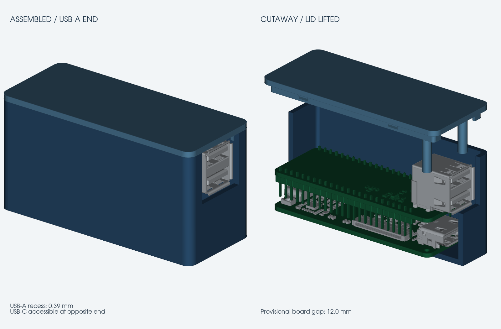

# Tang Nano 9K + USB LS HAT case

Two-piece, screwless enclosure for the Tang Nano 9K and the [USB low-speed sniffer HAT](../../docs/plan.md). The stacked USB-A ports face one end; the Tang's USB-C connector remains accessible at the other.



> [!IMPORTANT]
> The design assumes a **12 mm gap from the Tang's top PCB surface to the HAT's underside**. Measure your fully seated mating headers before printing. This is not total stack height. Physical fit and closed-case temperatures have not been tested.

## Files

| File | Purpose |
| --- | --- |
| [tang_nano_9k_base.stl](tang_nano_9k_base.stl) | Printable base, bottom down. |
| [tang_nano_9k_lid.stl](tang_nano_9k_lid.stl) | Printable lid, outside face down. |
| [tang_nano_9k_case.step](tang_nano_9k_case.step) | Editable base and lid in assembled position. |
| [tang-solid-reference.step](tang-solid-reference.step) | Solids-only Tang board reference for fit checks; not a printable case part. |
| [hat-fit-standard.step](hat-fit-standard.step) | Generated HAT board and standard component models for fit checks. |
| [tang_nano_9k_case.py](tang_nano_9k_case.py) | Parametric CadQuery source; exports the STLs and STEP. |
| [check_case.py](check_case.py) | Checks geometry, meshes and component fit, then generates the preview. |
| [requirements.txt](requirements.txt) | Python dependencies for the generator, checks and preview. |
| [tang_nano_9k_preview.png](tang_nano_9k_preview.png) | Assembled and cutaway views. |

## Generate models and preview

Run these PowerShell commands from the **repository root**, not from inside `hardware/case`.

Generate the HAT reference before the first check and after PCB changes (KiCad 10 path shown; adjust if installed elsewhere):

```powershell
& "C:\Program Files\KiCad\10.0\bin\kicad-cli.exe" pcb export step --force --component-filter "J1,J2,U3,C*,R*,D*" --user-origin 135x63mm -o hardware/case/hat-fit-standard.step hardware/board/tang_nano_hat.kicad_pcb
```

`--force` replaces the generated HAT reference. The command does not modify the PCB.

Generate the printable models after changing dimensions:

```powershell
& .\hardware\case\.venv\Scripts\python.exe .\hardware\case\tang_nano_9k_case.py
```

Run all checks and generate the preview:

```powershell
& .\hardware\case\.venv\Scripts\python.exe .\hardware\case\check_case.py
```

`check_case.py` takes **no command-line options**. It always checks the exported meshes and reference models, then replaces `hardware/case/tang_nano_9k_preview.png`. Allow a few minutes. It does not regenerate the STL files or export the PCB automatically.

With Python 3.12 installed, create the environment and install dependencies using standard `venv` and `pip`:

```powershell
py -3.12 -m venv hardware/case/.venv
& .\hardware\case\.venv\Scripts\python.exe -m pip install -r hardware/case/requirements.txt
```

### Required reference models

The generator can run without external board models. **The checker and preview require all three files below.** Paths are relative to the repository root.

| Path | Required contents |
| --- | --- |
| `hardware/case/hat-fit-standard.step` | Current HAT exported from KiCad with origin `135x63mm` and component filter `J1,J2,U3,C*,R*,D*`. |
| `hardware/case/tang-solid-reference.step` | The 243 solids from Sipeed's `Tang_Nano_9K_3672.step`, excluding its open/unbounded surfaces. |
| `hardware/board/libraries/C456021.3dshapes/USB-A-TH_AF-SS-JB17.6.step` | J3 connector model already included in the component library. |

Both board references live in `hardware/case/`. Generate or refresh the HAT reference with the command above before running `check_case.py`.

<details>
<summary>Prepare or refresh the reference files</summary>

For the HAT reference, use the export command above. The Tang reference only needs regenerating if it is missing or you want to refresh it. Download `Tang_Nano_9K_3672_step.rar` from [Sipeed's Tang Nano 9K 3D files](https://dl.sipeed.com/shareURL/TANG/Nano%209K/5_3D_file) and extract `Tang_Nano_9K_3672.step` into `production` (create that directory if needed). Prepare the solids-only reference:

```powershell
& .\hardware\case\.venv\Scripts\python.exe -c "import cadquery as cq; model = cq.importers.importStep('production/Tang_Nano_9K_3672.step'); cq.exporters.export(cq.Compound.makeCompound(model.solids().vals()), 'hardware/case/tang-solid-reference.step')"
```

The checker excludes the Tang reference's two downward male-header models and uses conservative header clearance volumes instead. Choose actual complementary male/female headers; the illustrated models do not specify a mating pair.

</details>

## Fit and adjustments

Current model dimensions are **78 × 32.4 × 40.7 mm**, with 2 mm walls, floor and lid, and 4 mm clearance below the Tang PCB. Both PCBs are nominally 70 × 26 × 1.6 mm.

J3 is at KiCad **X=162.3, Y=63 mm, rotation 90°**, giving approximately **0.39 mm recess** behind the case face. The shared USB-A opening is 20 × 18.5 mm; the USB-C opening is 14 × 8 mm with bevelled corners.

Adjust the constants at the top of `tang_nano_9k_case.py`:

- `STACK_GAP`: measured Tang-top to HAT-underside distance. Values below 10 mm require a new component-clearance assessment and are rejected.
- `LID_GAP` / `RIB_PROJECTION`: loosen or tighten the lid's friction fit.
- `PEG_DIAMETER`: fit of the locating pegs in the Tang's mounting holes.
- `USB_A_WIDTH`, `USB_WIDTH` and `USB_HEIGHT`: connector/cable clearance.
- `J3_X`: connector X position relative to the PCB centre: **KiCad X minus 135 mm**. The reference model and clearance checks share this value.

After changing dimensions, regenerate both parts and rerun the checker. **Do not scale the STLs** to change the stack gap. Re-export the HAT reference after moving components; changes to connector rotation, Y position or board outline require corresponding source updates.

J3's raw STEP and the WRL used by the PCB have different origins. The checker aligns the STEP by `(0, -3.862, +4.090841)` mm before rotation and placement. Do not substitute the raw STEP blindly in a board export. U1/U2 clearance is checked using a conservative component envelope.
